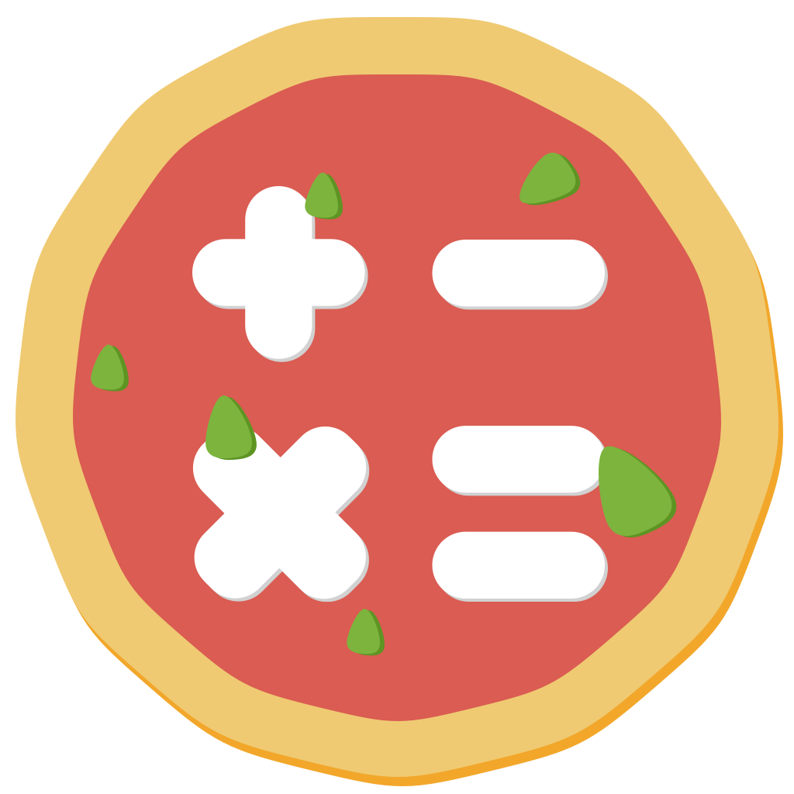
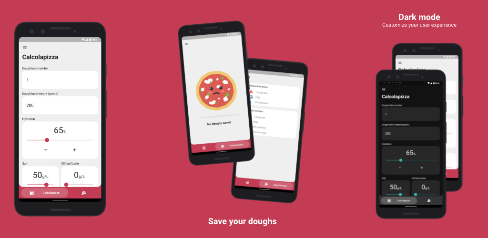

  
  <h1>Calcolapizza</h1>

Calcolapizza lets you calculate the exact recipe for your pizza doughs in a few seconds. Set how many dough balls you want to make, their weight, the desired hydration and all the other values and calculate your custom pizza recipe. You can also save it for future use or share it with your friends.

Calcolapizza is an Android version of the official tool from the forum [La Confraternita della Pizza](https://www.laconfraternitadellapizza.net/), every credits go to them.

The app works perfectly on iOS too but I don't have an Apple Developer Account and I'm not interested in it at the moment, sorry Apple users 🤷🏻‍♂️

  

## 🍕The original neapolitan style pizza recipe
This is in my opinion from where you should start if you never made a pizza dough, set values on the app as following:
- **Dough balls number:** how many pizzas you want to make, for example enter 3 if you're going to make 3 pizzas.
- **Dough balls weight:** 250g
- **Hydration:** 58-60%
- **Salt:** 50g/L, it means 50g per liter of water in the recipe. The same is for Oil/lard/butter.
- **Oil/lard/butter:** 0g/L
- **Room temperature:** take a look at your thermostat 😂
- **Rising time:** 8h
- **Fridge rising time:** 0h, the dough will stay at room temperature all the time, you'll never put it in the refrigerator.
- **Grandma pizza:** disabled

Check [this video](https://youtu.be/z2u1RRPu2AA) for the entire process and some good tips.

## 🏳️‍🌈 Help with translations
Currently only English and Italian are supported, if you want to submit a new translation you have to:
1. add strings in [lang.json](assets/lang/lang.json), use the language code as key.
2. add new Locale in supportedLocales in [main.dart](lib/main.dart)
3. add language code in [Info.plist](ios/Runner/Info.plist)

If you want to improve an existing translation you just need to follow the step 1.

## 🤝 Show your support
If you liked the app give this repo a ⭐️ and don't forget to visit [La Confraternita della Pizza](https://laconfraternitadellapizza.forumfree.it/), they have an [english section](https://laconfraternitadellapizza.forumfree.it/?f=64830886) too! 
